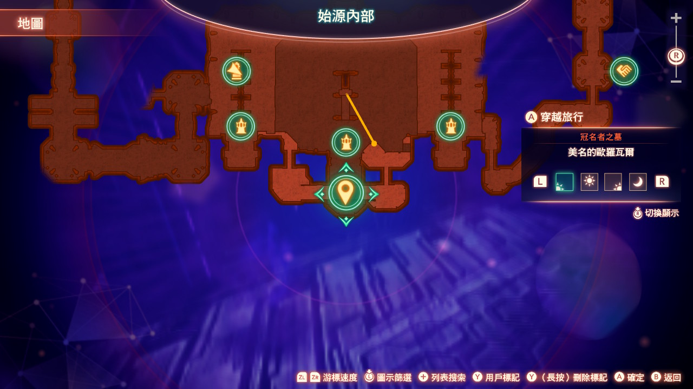
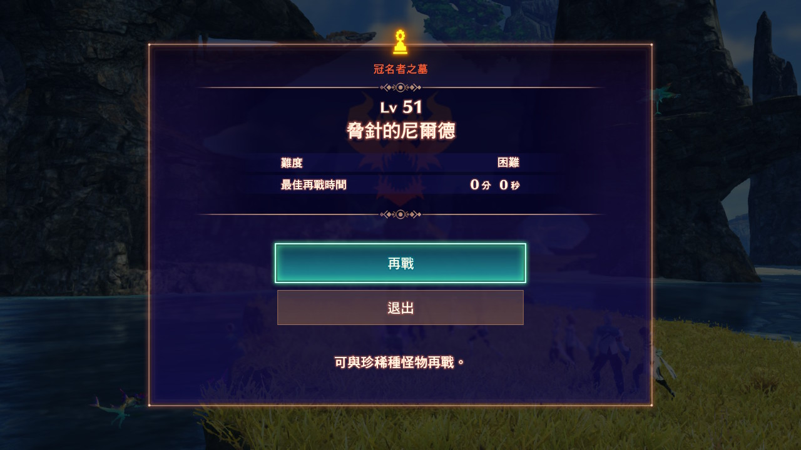

# picgo_assets

## 金鏟鏟 遊戲百科

### 連勝速 8 (3/4 費主 C)

- 2-1 極限連勝與最大化利息
  根據開局胡的裝備選擇陣容方向，強勢羈絆與體系內陣容最大化前十連勝，2-3 最好有 10 塊極限利息
- 2-5 升 5 體系內極限連勝利息過渡
  直接最佳過渡裝備加棋子極限連勝，最大化利息 (2-5 必須 10+經濟，2-6 應該有 20+經濟)
- 3-2 升 6 靈活運用強勢卡
  極限經濟與血量，根據節奏 30+的經濟可以花掉湊關鍵羈絆和卡，最低花到 20，根據天胡主 C 裝備微調方向
- 4-1 升 7 先最低 D 到 30,卡 50 利息找關鍵卡
  胡一些穩血卡，連勝足夠好，就直接賣一點血速 8，如果質量較差，可以小 D 湊一下體系低費卡 2 星，保證 4 階段不被血入的強度即可
- 4-5 或 5-1 升 8 大 D 找到關鍵主 C 兩星
  直接大 D 找到關鍵主 C 兩星，湊齊整體陣容質量穩住 5 階段節奏，然後卡著利息 D 陣容整體質量和賭主 C 三星，如果陣容 9 人口可以掛更高羈絆，6-1 直接拉 9 掛更強羈絆五費，主 C 沒兩星和 8 人口滿羈絆陣容直接 8 人口 D 到死。

### 連勝速 7 (2/3 費主 C)

- 2-1 升 4 上最強卡，前期最大化連勝
  根據開局胡的裝備選擇陣容方向，強勢羈絆與體系內陣容最大化前十連勝，2-3 最好有 10 塊極限利息
- 2-5 升 5
  直接最佳過渡裝備加棋子極限連勝，最大化利息 (2-5 必須 10+經濟，2-6 應該有 20+經濟)
- 3-2 升 6 靈活運用強勢卡，可以提速
  極限最大化經濟與血量，根據裝備決定主 C 陣容，
  比較崩可以 D 到最低 20 湊更完美羈絆靠連勝拉經濟
- 4-1 升 7 先 D-下找關鍵的主 C 兩星與陣容
  開始提速，整體先 D-下湊主 C 兩星與陣容兩星，提升質量，湊齊完美羈絆，然後可以每回合 D 幾下提升陣容，卡著 50 利息賭關鍵三星
- 5-1 或者 3 再次提速找關鍵 23 費三星
  2 費卡 5-1 提速，3 費卡 5-3 提速大 D 找關鍵的三星，找到關鍵三星後根據容錯卡著利息上人口或者直接提速 8 人口，掛關鍵的羈絆和五費卡賭剩下的陣容三星即可

### 賭狗手法 (1 費賭 3 星)

- 2-1 不升人口 最大化開局利息
  正常上陣容，輸輸贏贏都可以，找主 C 裝備
- 2-3 自然升 4
  前期正常運營，沒什麼特別的，發力點在 3 階段，選秀找強勢裝備
- 3-1 升 5 先大 D 一波湊陣容 2 星，慢 D3 星
  先 3-1D 一波湊一下陣容的 2 星和關鍵賭 3 星，然後卡 50 利息慢 D 主 C 三星，胡了即可人口
- 4-1 升 7 3-7 還不出三星，則卡利息升人口
  到了 4-1 就不能再虧羈絆了，拉人口提質量，然後留在 7 人口慢慢賭陣容內的三星，賭成之後再上八人口，即使一費卡剩的不多也是容易三星的
- 5-1 或 3 再次提速找關鍵 23 費三星
  再次提速找關鍵的 123 費三星，找到關鍵三星後根據容錯卡著利息上人口或者直接提速 8 人口，掛關鍵的羈絆和五費卡賭剩下的陣容三星即可

### 連敗手法

- 2-1 升 3 極限利息
  打野有青鋼影或諾手時可以只上青鋼影或諾手，開局必定 10 元利息
- 2-3 升 4
  極限 20+利息恰經濟，賣血選秀完美神裝，保證開局 5 連敗和極限最大利息，前期有 3 龍族上 3 龍族
- 3-2 升 6 最低花到 20 提升質量連勝
  打野開始卡 50 利息上人口，最快 3-1 六人口，最低花到 20，找關鍵羈絆主 C 兩星或者穩血保證 3 階段連勝
- 4-1 升 7 先穩血卡 50 利息賭 3 星
  最低 D 到 20 找關鍵主 C 兩星和整體羈絆，保證 4 階段穩血連勝後卡著 50 利息慢慢 D 陣容關鍵的三星，靠著完美神裝和整體陣容鎖血
- 5-1 或者 3 再次提速找關鍵 23 費三星
  賭 2 費 5-1 大 D 找出關鍵主 C 三星，賭 3 費可以到 5-3 再大 D 賭關鍵三星，關鍵三星出來了可以卡著利息或看情況提速 8 人口，多掛羈絆和賭剩下的三星即可

### 變異戰士 - 羈絆效果

- 【突觸網絡】 "變異戰士"們的技能消耗降低 20 法力。 （最低為 10 法力）；

- 【超級腎上腺】 "變異戰士"們的攻擊有 33%機率對其目標出發 2 次額外攻擊；

- 【破蛹之變】 "變異戰士"們每經過 2 秒就會成長，獲得+18 護甲和魔法抗性、+1 攻擊力和法術強度，至多可疊加 5 次；

- 【旺盛胃口】 "變異戰士"們在每有一名友軍陣亡時會變得更強，獲得＋ 20 攻擊力和法術強度；

- 【生命汲取】 己方隊伍獲得 30%全能吸血（基於已造成傷害值提供治療效果）；

- 【源計劃增幅】 攜帶了至少 1 件裝備的"變異戰士"們會獲得額外 450 生命值和 30 攻擊力；

- 【虛空降生】 如果"變異戰士"們的傷害使目標跌到 20%生命值以下，就會將目標處決

### 刷新機率

|      | 1 費 | 2 費 | 3 費 | 4 費 | 5 費 |
| :--: | :--: | :--: | :--: | :--: | :--: |
| 數量 |  29  |  22  |  18  |  12  |  10  |
| Lv2  | 100% |      |      |      |      |
| Lv3  | 75%  | 25%  |      |      |      |
| Lv4  | 50%  | 30%  | 20%  |      |      |
| Lv5  | 40%  | 33%  | 25%  |  2%  |      |
| Lv6  | 25%  | 40%  | 30%  |  5%  |      |
| Lv7  | 19%  | 30%  | 35%  | 15%  |  1%  |
| Lv8  | 15%  | 20%  | 35%  | 25%  |  5%  |
| Lv9  | 10%  | 15%  | 30%  | 30%  | 15%  |

### 連勝/敗 獎勵

|   場數    | 金幣獎勵 |
| :-------: | :------: |
| 1 連勝/敗 |          |
| 2 連勝/敗 |  1 金幣  |
| 3 連勝/敗 |  1 金幣  |
| 4 連勝/敗 |  2 金幣  |
| 5 連勝/敗 |  3 金幣  |
| 6 連勝/敗 |  3 金幣  |
| 7 連勝/敗 |  3 金幣  |
| 8+連勝/敗 |  3 金幣  |

### 升級經驗

|  等級  | 經驗值 |
| :----: | :----: |
| 1 => 2 |        |
| 2 => 3 |   2    |
| 3 => 4 |   6    |
| 4 => 5 |   10   |
| 5 => 6 |   20   |
| 6 => 7 |   36   |
| 7 => 8 |   56   |
| 8 => 9 |   80   |

| 寶珠名稱 |      素材名稱      |                    冠名者                    |                     位置                     |                其他推薦                |                                        |
| :------: | :----------------: | :------------------------------------------: | :------------------------------------------: | :------------------------------------: | :------------------------------------: |
| 順風而行 |  駝鹿獸的發光叉角  |             Lv61 樹角的庫提諾斯              |              亞艾提亞地區上層部              |                                        |                                        |
| 順風而行 |                    |    |    |                                        |                                        |
| 順風而行 |    巨蛙的黃金油    |              Lv81 粗野的古羅肯               |                  佛尼斯地區                  |                                        |                                        |
| 順風而行 |                    |      |      |                                        |                                        |
| 順風而行 |   巨蜂的輕薄翅膀   |              Lv27 喧囂的林普斯               |                 潘特拉斯地區                 |                                        |                                        |
| 順風而行 |                    |      |      |                                        |                                        |
| 順風而行 |     巨蟻的腿殼     |              Lv77 蜘害的嘉莫德               |                 嘉登西亞地區                 |                                        |                                        |
| 順風而行 |                    |      |      |                                        |                                        |
| 順風而行 |   始祖古鳥的薄翼   |              Lv78 嚴峻的菲涅克               |              莫爾克納大森林下層              |                                        |                                        |
| 順風而行 |                    |      |      |                                        |                                        |
| 銅牆鐵壁 |    弗拉克的鐵片    |             Lv67 爬行的哈馬耶爾              |                     始源                     |                                        |                                        |
| 銅牆鐵壁 |                    |    |    |                                        |                                        |
| 銅牆鐵壁 |    巨甲蟲的鎧翅    |            Lv75 妖蟲的克雷奧諾爾             |                 嘉登西亞地區                 |                                        |                                        |
| 銅牆鐵壁 |                    |  |  |                                        |                                        |
| 銅牆鐵壁 |   寄居蟹的盾狀蝥   |             Lv21 尋找住處的卡利              |                 亞艾提亞地區                 |                                        |                                        |
| 銅牆鐵壁 |                    |    |    |                                        |                                        |
| 銅牆鐵壁 |  佛庫克的金屬碎片  |             Lv86 美名的歐羅瓦爾              |                     始源                     |                                        |                                        |
| 銅牆鐵壁 |                    |    |    |                                        |                                        |
| 銅牆鐵壁 | 輔騎型兵器的外裝甲 |               Lv37 輔騎型兵器                |              第二浮游岩礁休息地              |                                        |                                        |
| 銅牆鐵壁 |                    |        |        |                                        |                                        |
| 絕對反擊 |   始祖古鳥的鉤爪   |              Lv78 嚴峻的菲涅克               |              莫爾克納大森林下層              |                                        |                                        |
| 絕對反擊 |                    |      |      |                                        |                                        |
| 絕對反擊 |  海膽怪的鋼鐵鱗片  |              Lv51 脅針的尼爾德               |                 嘉登西亞地區                 |                                        |                                        |
| 絕對反擊 |                    |      |      |                                        |                                        |
| 絕對反擊 |     鎧蠍的鎧螯     |            Lv25 岩螯的戈爾薩利斯             |                  佛尼斯地區                  |            Lv68 蘭達克鎧蠍             |               佛尼斯地區               |
| 絕對反擊 |                    |  |  |  |  |
| 絕對反擊 |     巨蟻的巨顎     |              Lv77 蜘害的嘉莫德               |                 嘉登西亞地區                 |                                        |                                        |
| 絕對反擊 |                    |      |      |                                        |                                        |
| 絕對反擊 |    弗拉克的鐵片    |             Lv67 爬行的哈馬耶爾              |                     始源                     |                                        |                                        |
| 絕對反擊 |                    |    |    |
